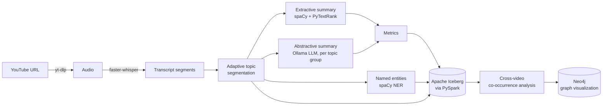
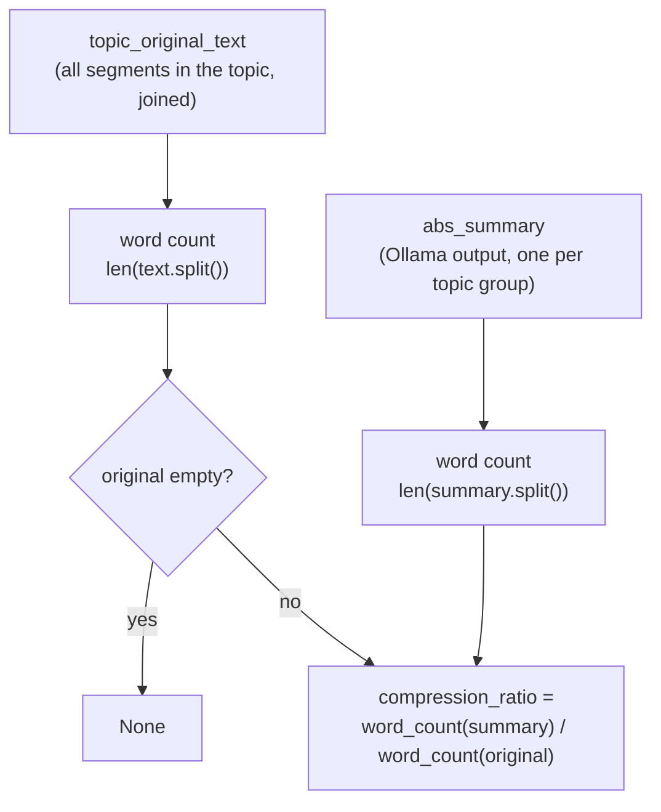
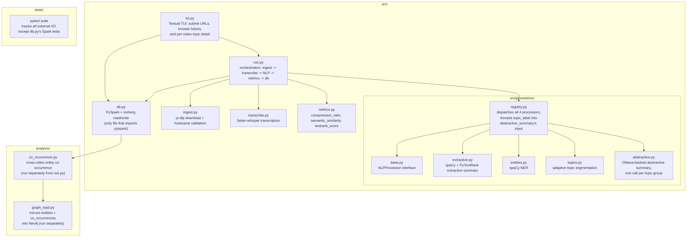

# Podscope

A local, zero-cost multi-video NLP analysis pipeline. Point it at YouTube
videos and it transcribes them, segments the transcript into topics, runs
extractive summarization, named entity recognition, and topic-grouped
abstractive summarization, scores how much each summary technique
preserves or compresses the original meaning, and stores everything in an
Apache Iceberg lakehouse for cross-video entity co-occurrence analysis
(browsable as a graph in Neo4j).

No paid APIs: transcription runs on [faster-whisper](https://github.com/SYSTRAN/faster-whisper),
abstractive summarization runs on a local [Ollama](https://ollama.com) model.

## Pipeline



Topic segmentation runs first and groups contiguous segments by embedding
similarity, using a **per-video adaptive threshold** (`mean + std_multiplier
* stdev` of that video's own adjacent-segment distances, see
[`src/processors/topics.py`](src/processors/topics.py)) instead of one fixed
cutoff — short conversational segments and long-form narration have very
different similarity distributions, so a fixed threshold either
over-splits or under-splits depending on the video. Abstractive
summarization then runs once per topic group (not once per raw ASR
segment) so the LLM sees a whole topic's dialogue instead of a
few-word fragment with no context.

## Compression ratio algorithm

Each topic group's abstractive summary is scored against the transcript
text it was actually generated from — the concatenated text of every
segment in that topic — by word-count ratio, how much shorter the summary
is than its source:



`compression_ratio(original, summary)` in [`src/metrics.py`](src/metrics.py):

```python
def compression_ratio(original: str, summary: str) -> float | None:
    if not original.strip():
        return None
    return len(summary.split()) / len(original.split())
```

A lower ratio means more aggressive compression (e.g. `0.15` = the summary
is 15% the length of the topic's original text). It's computed only for
the abstractive summary — the extractive summary is a selected sentence
lifted verbatim from the transcript, not a generated compression, so
comparing it the same way isn't meaningful.

Every segment in a topic group stores the same `abs_summary` and the same
`compression_ratio` (computed once per topic, not once per segment) —
`_merge_nlp` in [`src/run.py`](src/run.py) builds each topic's full
original text before scoring, since scoring the topic-level summary
against any *one* segment's own few-word fragment inflates the ratio well
past 1.0.

This is one of three quality metrics computed by `metrics.compute_all()`,
alongside `semantic_similarity` (embedding cosine similarity between the
segment-level extractive summary and the topic-level abstractive summary,
via `sentence-transformers` — note the two operate at different
granularities) and `textrank_score` (the extractive summary's PyTextRank
sentence score).

## Project layout



## Requirements

- Python 3.11
- Java 17 (Temurin/OpenJDK) — required by PySpark
- [Ollama](https://ollama.com) running locally, with a model pulled
  (default: `llama3.2:latest`)
- `ffmpeg`

## Setup

```bash
pip install -r requirements.txt
python -m spacy download en_core_web_sm
ollama pull llama3.2:latest   # if not already pulled
```

## Usage

```bash
python -m src.run --url "https://www.youtube.com/watch?v=<id>"
python -m src.run --urls-file urls.txt

# after processing multiple videos:
python -m analysis.co_occurrence --min-videos 2 --top-n 30

# then, to browse the co-occurrence graph in Neo4j (see Graph below):
python -m analysis.graph_load
```

### TUI

```bash
pip install -e .
podscope   # or: python -m src.tui
```

A terminal landing screen to paste a URL, watch progress, and browse history --
launches instantly and runs the pipeline above in the background. From
History, press Enter (or click a row) to open a per-video detail screen:
segment/topic counts, average compression ratio and semantic similarity,
top entities, and a time-ranged breakdown of every topic's summary.

### Graph

`analysis/graph_load.py` mirrors `entities` and `co_occurrences` into Neo4j
as `(:Entity)-[:CO_OCCURS_WITH]->(:Entity)`, for visual exploration:

```bash
docker compose up -d neo4j
python -m analysis.co_occurrence   # populates co_occurrences first
python -m analysis.graph_load
```

Then open [http://localhost:7474](http://localhost:7474) (login
`neo4j` / `podscope-local`, from `docker-compose.yml`) and run:

```cypher
MATCH (a)-[r:CO_OCCURS_WITH]->(b) RETURN a, r, b
```

## Docker

Runs the pipeline in a container against a host-run Ollama instance:

```bash
YOUTUBE_URL="https://www.youtube.com/watch?v=<id>" docker-compose up
```

## Tests

```bash
pytest tests/
```

CI (`.github/workflows/ci.yml`) runs the full pytest suite and a
`docker build` check on every push/PR to `main`.

## License

MIT
