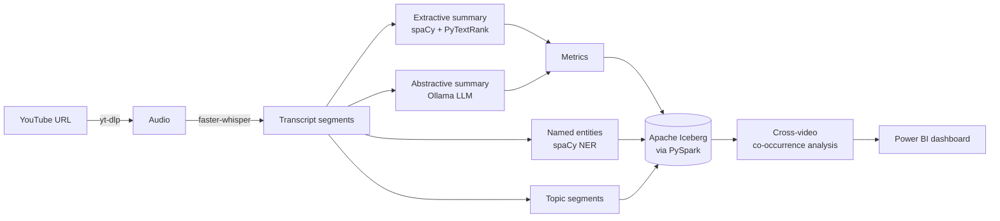
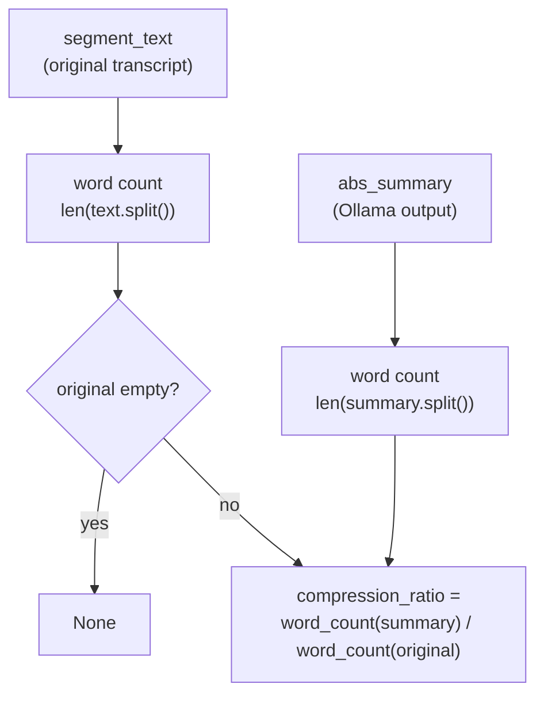
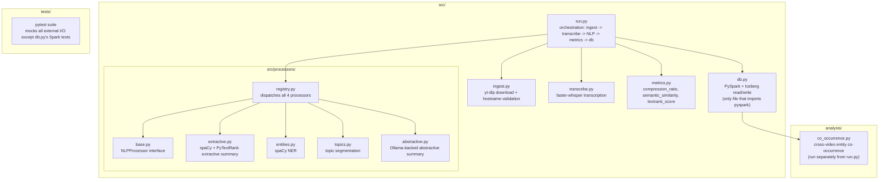

# Podscope

A local, zero-cost multi-video NLP analysis pipeline. Point it at YouTube
videos and it transcribes them, runs four independent NLP techniques over
each transcript segment, scores how much each summary technique preserves
or compresses the original meaning, and stores everything in an Apache
Iceberg lakehouse for cross-video entity co-occurrence analysis.

No paid APIs: transcription runs on [faster-whisper](https://github.com/SYSTRAN/faster-whisper),
abstractive summarization runs on a local [Ollama](https://ollama.com) model.

## Pipeline



## Compression ratio algorithm

Each segment's abstractive summary is scored against the original
transcript text by word-count ratio — how much shorter the summary is
than the source it was generated from:



`compression_ratio(original, summary)` in [`src/metrics.py`](src/metrics.py):

```python
def compression_ratio(original: str, summary: str) -> float | None:
    if not original.strip():
        return None
    return len(summary.split()) / len(original.split())
```

A lower ratio means more aggressive compression (e.g. `0.15` = the summary
is 15% the length of the original segment). It's computed only for the
abstractive summary — the extractive summary is a selected sentence lifted
verbatim from the transcript, not a generated compression, so comparing it
the same way isn't meaningful.

This is one of three per-segment quality metrics computed by
`metrics.compute_all()`, alongside `semantic_similarity` (embedding cosine
similarity between the extractive and abstractive summaries, via
`sentence-transformers`) and `textrank_score` (the extractive summary's
PyTextRank sentence score).

## Project layout



## Requirements

- Python 3.11
- Java 17 (Temurin/OpenJDK) — required by PySpark
- [Ollama](https://ollama.com) running locally, with a model pulled
  (default: `llama3.2:latest`)
- `ffmpeg`

## Setup

```bash
pip install -r requirements.txt
python -m spacy download en_core_web_sm
ollama pull llama3.2:latest   # if not already pulled
```

## Usage

```bash
python src/run.py --url "https://www.youtube.com/watch?v=<id>"
python src/run.py --urls-file urls.txt

# after processing multiple videos:
python analysis/co_occurrence.py --min-videos 2 --top-n 30
```

### TUI

```bash
pip install -e .
podscope   # or: python -m src.tui
```

A terminal landing screen to paste a URL, watch progress, and browse history --
launches instantly and runs the pipeline above in the background.

## Docker

Runs the pipeline in a container against a host-run Ollama instance:

```bash
YOUTUBE_URL="https://www.youtube.com/watch?v=<id>" docker-compose up
```

## Tests

```bash
pytest tests/
```

CI (`.github/workflows/ci.yml`) runs the full pytest suite and a
`docker build` check on every push/PR to `main`.

## License

MIT
